# Sell/dump your PoW ETH
If you want to sell your PoW ETH you are in luck. Basically a sale boils down to visiting the PoWDump website and 
creating a swap offer through the interface. If you want to learn how the swap works on a technical level, check out the
[how the swap works](/getting-started/how-it-works) page.

:::caution Stay on the website
The PoWDump app is not an AMM(Automated Market Maker). Other traders, bots will match your offer if they find it profitable
for them.

The nature of an cross-chain atomic swap is:
1. You lock funds on the PoW chain (the locked funds are protected by a hash of a secret that you only know - stored in your browser's local storage)
2. Traders/bots see your offer on the PoW chain and match it on the PoS chain
3. They lock the amount of ETH you want with the same hash you provided in `step 1`
4. You reveal the secret on the PoS chain and the funds are unlocked and sent to you
5. The traders/bots see the secret on the PoS chain and submit a tx with it on the PoW chain and get the funds you locked in `step 1`

Because your swap and the traders/bots swaps are time limited you need to be online at all times in oder to
sign the reveal transaction. If you fail to sign the reveal transaction the deal is not going to succeed and you will
have to get back your funds from the contract by submitting a `refund transaction`.
:::

What follows is a step-by-step instruction on how to sell your PoW ETH.

## Step-by-step guide

### 1. Visit the PoWDump App website
Go to the PoWDump App website and connect your Metamask wallet by clicking the `Connect wallet` button on the top right. 

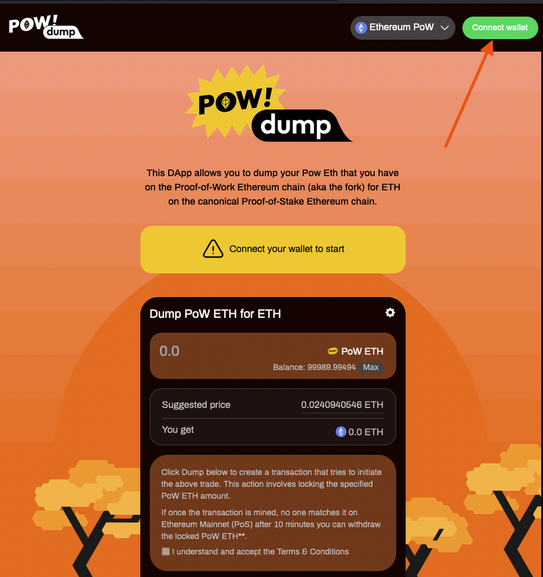

### 2. Switch the Ethereum PoW network you want to dump from
Use the networks dropdown to select the Ethereum PoW network you want to dump from.

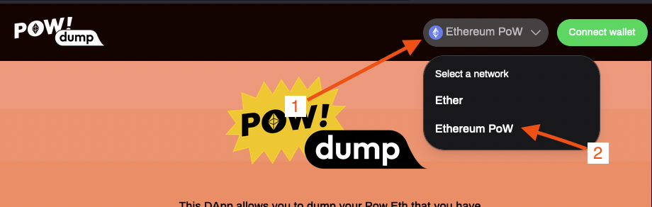

If the network is not already in your `Metamask` wallet, `Metamask` will pop up and will ask you to add it.

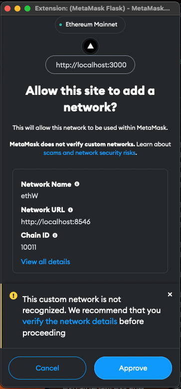

### 3. Create a swap offer

Once you've switched to the correct network the UI will let you enter an amount of ETH to sell.

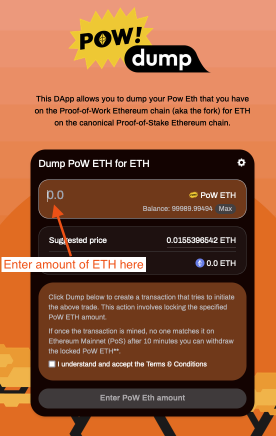

:::tip
You can use the `Max` button to enter the maximum amount of ETH you want to dump. The `Max` button will keep 0.3ETH in
your wallet. 0.1ETH to pay for the transaction fees and 0.2ETH as a buffer to cover the gas fee and contract interaction
in case the swap is not matched and you need a refund.
:::
Based on the suggested price, the interface will update the amount of ETH a counterparty needs to lock on the PoS chain.

:::info Suggested Price
The suggested price is based on the current price of PoW ETH as provided by coingecko.com minus 2%. For a volatile market
this 2% discount improves the chance that a counterparty will match your offer.

:::

If you want to use a custom price for your swap offer, you can enter your own `custom price` in the `Settings` menu.

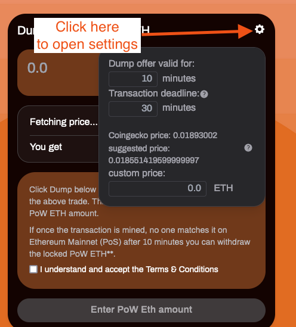

Other parameters that you can modify in the settings are the `Dump offer valid for` & `Transaction deadline`.

:::note
`Dump offer valid for` specifies how long your swap is valid once the transaction is mined. Don't set this value too low
as counterparties need time to lock their ETH on the PoS chain and you would also need time to reveal your swap secret.
:::

:::note
`Transaction deadline` specifies how long you are willing to wait for your offer to be included in a block. If the PoW
chain is congested it can take a lot of time until your transaction gets included and by that time the price of PoW ETH
could have moved substantially up or down. The `transaction deadline` basically fails the transaction if it is not included
in the specified time.
:::

Once you are happy with the amount you want to sell check the `I agree to the terms and conditions` checkbox and
then press the `Dump now` button to create your swap offer.

You'll be presented with a confirmation screen like this one:

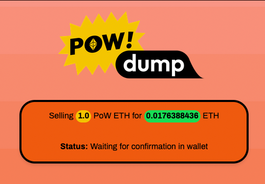

Once you confirm the transaction in `Metamask` and the transaction is mined you will see a screen like this one:

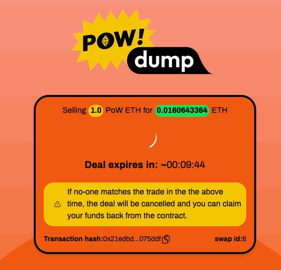

:::warning
You should not leave the page, because you'll have to reveal your swap secret if there is a counterparty that matched
your swap on the PoS chain.
:::

If the app finds a match you should switch to the PoS chain

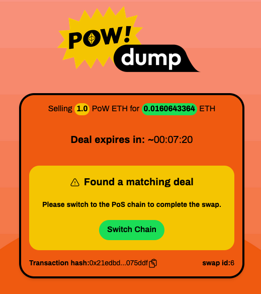

now you should see the swap offer of the counterparty. The counterparty should have locked the amount of ETH you requested.

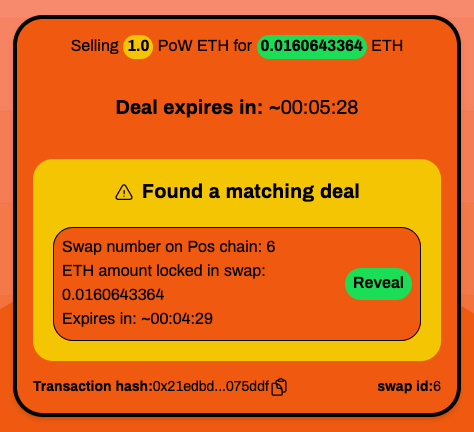

press `Reveal` & then confirm the transaction in `Metamask`. Once the TX is mined the swap should be complete.

:::danger
Notice that your swap offer was expiring slower than the counterparty offer. Counterparties
are setting lower expiration times in order for them have enough time to grab the secret from your PoS transaction and
submit it on the PoW chain. If they fail to submit the reveal transaction on the PoW chain in time, then they won't
receive your PoW ETH.
:::

:::caution
If the counterparty offer expires in less than 20s the app will not let you reveal the secret. 20s is too little time for
the transaction to be included in a block, but if you submit it a bad actor could steal your secret and claim your PoW ETH.

Generally when revealing the TX on the PoS chain you should set higher gas fees for the transaction to be included faster.
:::

## How to get a refund?

If a swap deal fails for whatever reason (no-one matched your offer, you didn't reveal the secret in time) you can get back
your locked funds from the contract. To do that you need to submit a `refund transaction` on the PoW chain.

Once a swap is expired the app will propose to submit a refund transaction.

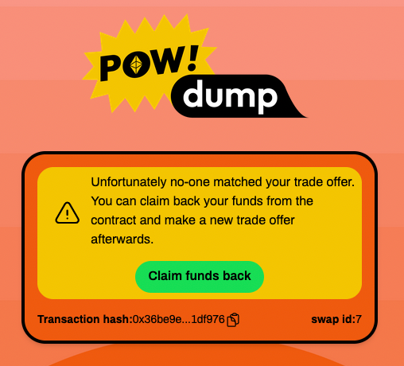

Click on `Claim funds back` and then confirm the transaction in `Metamask`. Once the transaction is mined the amount of
ETH you locked in the contract should be returned to your wallet.

## What happens if you close the page during a swap?

Well, you should not do that! But if you do, there are two scenarios:

**Scenario 1:**

If your swap offer is still valid (hasn't expired) the app will find it and will offer you to resume it:

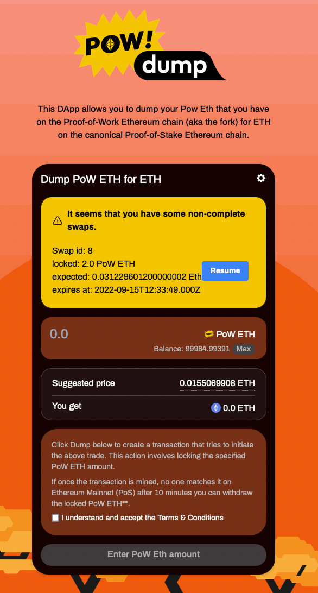

Click on resume and follow the on screen instructions and don't close the page again!

**Scenario 2:**

If your swap offer has expired you can find your transaction history by clicking on your account address (top right).
You will be presented with a screen like this:
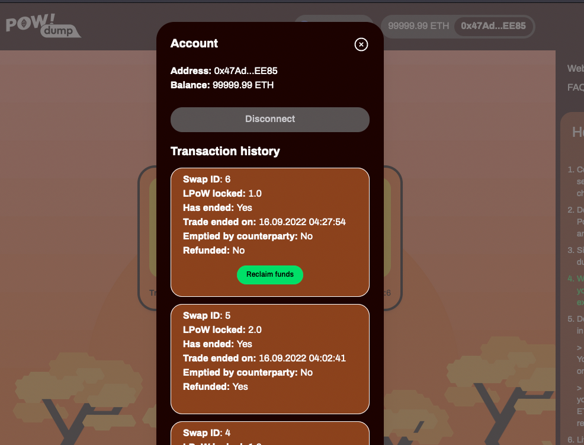

The app should display a refund button next to the expired non-successful swap offers.