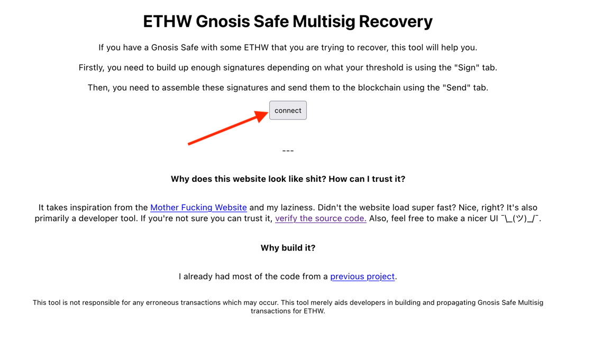
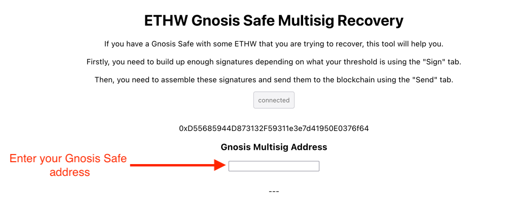
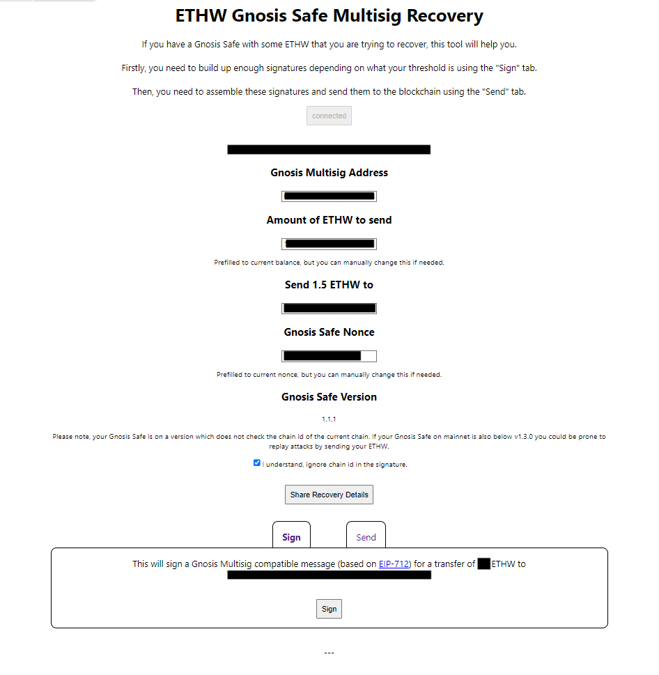
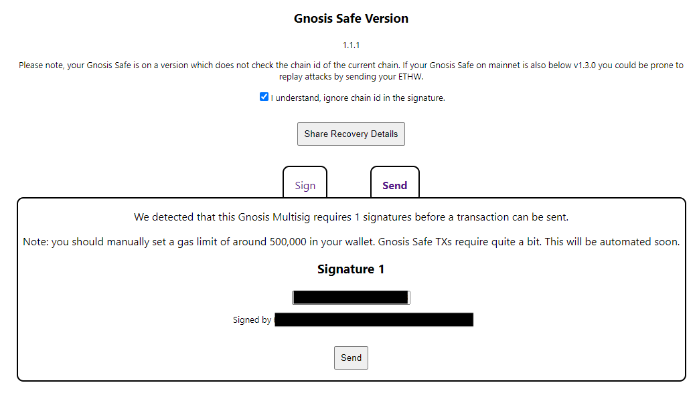

The [Official Gnosis Safe app](https://gnosis-safe.io/) doesn't work on the EthereumPoW chain. This makes it difficult
to interact with your Gnosis Safe.
Your locked ETH is stuck there, and you are watching how your friends are making millions of $$$ by dumping, but you
can't
take part on the action. Don't lose hope though! There is a way to move the ethW in your
Gnosis Safe to an Externally Owned Account (EOA) on EthereumPoW and then make lots of dough by dumping it with PoWDump.

This tutorial will teach you how to become even richer than you already are.

:::note
This tutorial makes use of the ethW gnosis recovery app. We are not affiliated with the ethW gnosis recovery app in any
way.
Use at your own risk.
:::

1. First create an EOA that you have the private keys to.
2. To Transfer the Gnosis Safe funds to the EOA you created in the previous step we'll use
the [ETHW Gnosis Multisafe Recovery app](https://github.com/devanonon/ethw-gnosis-recovery). You can either run the
app on your machine or use the hosted version on [github pages](https://devanonon.github.io/ethw-gnosis-recovery/#/).

3. Connect a wallet that is an owner of the Safe you want to transfer the funds from.

4. Once connected, enter the Safe address you want to transfer the funds from.

5. Once you enter a Safe address the app will present you with a screen similar to this:

Enter the amount of ethW you want to transfer and the EOA you created in step 1 in the corresponding fields.
Then sign a message with this data.

:::warning
In this case the connected Safe is in version 1.1.1 and the app is warning you that the transaction you are about to
sign could be replayed on Mainnet. To Prevent replay attacks you should upgrade your Safe on mainnet to version 1.3.0 or higher.
You can upgrade from the official Gnosis Safe app by navigating to `Settings` -> `Safe details` and clicking on the `Upgrade` button.

As a general rule of thumb - make sure that your Gnosis Safe on Mainnet has a higher nonce than the one on EthereumPoW.
This will make replay attacks impossible.
:::

6. If your safe requires just a single signature to execute a transaction, you can now execute the transaction by clicking
on send.

:::note
If you safe requires more than one transaction you will have to ask the other safe owners to also sign the message. They would
have to also use the `ETHW Gnosis Multisafe Recovery app`, enter the same values as you and sign the message with their account.
They can then give you the signature and you'll be able to enter it in the UI and execute the transaction.
:::

7. Once the funds have been transferred to your EOA, you can now take part on the action and execute the biggest dump ever!
For detailed instructions on how to dump use the [Seller step by step tutorial](/getting-started/seller).
